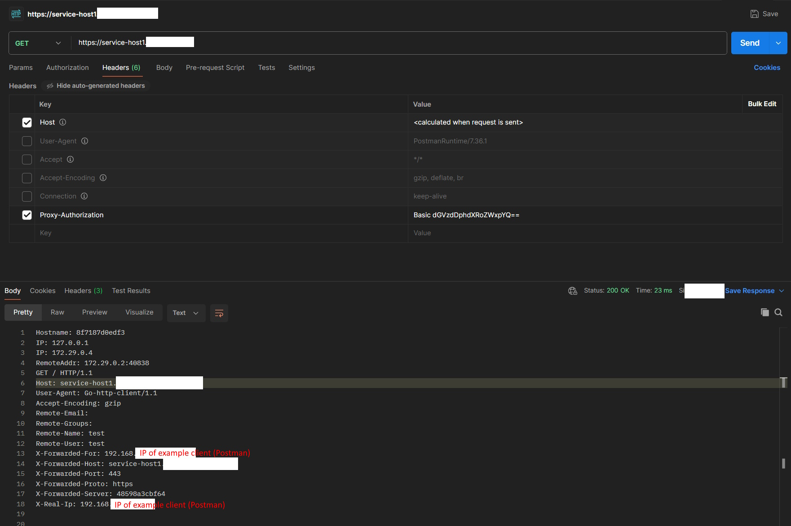
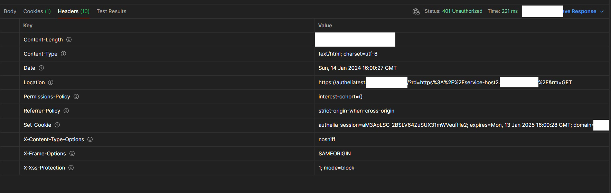

# AutheliaTraefikSetup

Clone onto two machines, insert your configuration in `.env` (on both machines) and start one stack per machine.

The domain names should point to the correct hosts:

```txt
authelia.example.com        ->  host1
traefik-host1.example.com   ->  host1
service-host1.example.com   ->  host1
traefik-host2.example.com   ->  host2
service-host2.example.com   ->  host2
```

## Results of testing

Tests are done using a third machine.

Using a browser (Firefox) works as expected. The services on both hosts require a login and are reachable afterwards.

The following requests are made using [Postman](https://github.com/postmanlabs) and should test the behavior with the `Proxy-Authorization` header:


A request to the service running on the same machine as Authelia (host 1) works fine. Apparently no cookies are created (! → <https://github.com/authelia/authelia/discussions/6508#discussioncomment-8120133>).

The exact same request, but targeting the service on host 2 (the `1` is replaced with a `2` within the URL, nothing else is changed):

A redirect to the Authelia login page.
